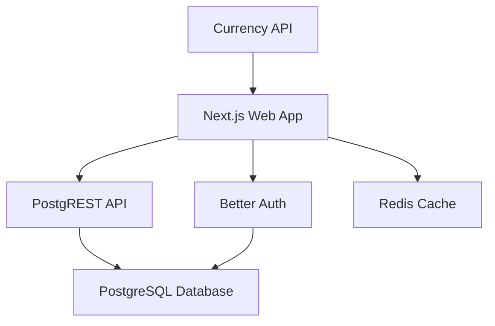

## Introduction

Budget Bee is designed to be self-hosted, giving you complete control over your financial data. This guide will walk you through the process of deploying Budget Bee on your own infrastructure.

## Architecture Overview

Budget Bee follows a modern microservices architecture with the following components:



### Core Components

<CardGroup cols={2}>
  <Card title="PostgreSQL" icon="database">
    Primary database storing all financial data, user accounts, and organizational information
  </Card>
  <Card title="PostgREST" icon="server">
    Auto-generated REST API from PostgreSQL schema with JWT authentication
  </Card>
  <Card title="Next.js App" icon="react">
    Frontend application and API routes for business logic
  </Card>
  <Card title="Redis" icon="memory">
    Optional caching layer for sessions and performance optimization
  </Card>
</CardGroup>

## Prerequisites

Before you begin, ensure you have the following installed:

<Steps>
  <Step title="Node.js 18+">
    Required for running the Next.js application
    ```bash
    node --version
    ```
  </Step>
  
  <Step title="pnpm Package Manager">
    Budget Bee uses pnpm for dependency management
    ```bash
    npm install -g pnpm
    ```
  </Step>
  
  <Step title="Docker & Docker Compose">
    Required for running PostgreSQL and PostgREST containers
    ```bash
    docker --version
    docker compose version
    ```
  </Step>
  
  <Step title="Git">
    For cloning the repository
    ```bash
    git --version
    ```
  </Step>
</Steps>

## System Requirements

### Minimum Requirements

- **CPU**: 2 cores
- **RAM**: 4GB
- **Storage**: 20GB SSD
- **OS**: Linux, macOS, or Windows with WSL2

### Recommended Requirements

- **CPU**: 4+ cores
- **RAM**: 8GB+
- **Storage**: 50GB+ SSD
- **OS**: Ubuntu 22.04 LTS or similar

## Deployment Options

<CardGroup cols={2}>
  <Card title="Docker Compose" icon="docker" href="/deployment/docker">
    Recommended for local development and small deployments
  </Card>
  <Card title="Kubernetes" icon="cubes" color="#326CE5">
    Scale Budget Bee with Kubernetes for production-grade deployments
  </Card>
  <Card title="Manual Setup" icon="wrench">
    Advanced - run services without containers
  </Card>
  <Card title="Cloud Platforms" icon="cloud">
    Deploy to AWS, GCP, Azure, or DigitalOcean
  </Card>
</CardGroup>

## Quick Start

For a rapid deployment using Docker Compose:

```bash
# Clone the repository
git clone https://github.com/sammaji/budgetbee
cd budgetbee

# Install dependencies
pnpm install

# Run the setup script
make setup
```

<Note>
The `make setup` command will:
- Install all dependencies
- Create environment files
- Start Docker containers
- Create database roles
- Run all migrations
- Configure JWT secrets
</Note>

## Port Configuration

By default, Budget Bee uses the following ports:

| Service | Port | Description |
|---------|------|-------------|
| PostgreSQL | 5100 | Database server |
| PostgREST | 5101 | REST API |
| Adminer | 5102 | Database admin UI |
| Web App | 3000 | Main application |
| Landing Page | 3001 | Marketing site |
| Docs | 3002 | Documentation |
| Currency API | 8787 | Exchange rates service |

<Warning>
Make sure these ports are available on your system before starting the services.
</Warning>

## Next Steps

<CardGroup cols={3}>
  <Card title="Docker Setup" icon="docker" href="/deployment/docker">
    Set up using Docker Compose
  </Card>
  <Card title="Database Migrations" icon="database" href="/deployment/database-migrations">
    Understand the migration process
  </Card>
  <Card title="PostgreSQL Config" icon="server" href="/infrastructure/postgresql">
    Configure PostgreSQL settings
  </Card>
</CardGroup>

## Getting Help

If you encounter issues during deployment:

- Check the [GitHub Issues](https://github.com/sammaji/budgetbee/issues)
- Email: [hello@sammaji.com](mailto:hello@sammaji.com)
- Twitter: [@sammaji15](https://x.com/sammaji15)
